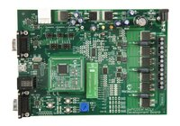

# Reference Applications for SAM MCUs

This package contains the MPLAB® Harmony 3 reference applications for the following SAM MCU development boards/kits.

| Board/Kit | Link |
| ---   | --- |
|    | [SAM C21 Xplained Pro evaluation kit](./sam_c21_xpro/readme.md) |
|    | [SAMC21N Xplained Pro Evaluation Kit](./sam_c21n_xpro/readme.md) |
|    | [SAM D21 Curiosity Nano Evaluation Kit](./sam_d21_cnano/readme.md) |
|    | [SAM D21 IoT v2 Development Board](./sam_d21_iot_v2/readme.md) |
|    | [SAM D21 Xplained Pro Evaluation Kit](./sam_d21_xpro/readme.md) |
|    | [SAM E51 Curiosity Nano Evaluation Kit](./sam_e51_cnano/readme.md) |
|    | [SAM E51 Integrated Graphics & Touch Curiosity Evaluation Kit](./sam_e51_igat/readme.md) |
|    | [SAM E54 Curiosity Ultra Development Board](./sam_e54_cult/readme.md) |
|    | [dsPICDEM™ MCLV-2 Development Board with SAME54 Motor Control PIM](./sam_e54_mcpim_mclv2/readme.md) |
|    | [SAM E54 Xplained Pro Evaluation Kit](./sam_e54_xpro/readme.md) |
|    | [SAM E70 Xplained Evaluation Kit](./sam_e70_xpld/readme.md) |
|    | [SAM E70 Xplained Ultra Evaluation Kit](./sam_e70_xult/readme.md) |
|    | [SAM L10 Xplained Pro Evaluation Kit](./sam_l10_xpro/readme.md) |
|    | [SAM L11 Xplained Pro Evaluation Kit](./sam_l11_xpro/readme.md) |
|    | [SAM L21 Xplained Pro Evaluation Kit](./sam_l21_xpro/readme.md) |
|    | [SAM L22 Xplained Pro Evaluation Kit](./sam_l22_xpro/readme.md) |

 Note: The application examples in this repository are an alternative source of reference covering the above types. MPLAB Harmony 3 provides more product-specific examples on peripherals, drivers and middleware technologies. More such examples are available in the product/technology-specific repositories like [csp](https://github.com/Microchip-MPLAB-Harmony/csp), [core](https://github.com/Microchip-MPLAB-Harmony/core), [usb](https://github.com/Microchip-MPLAB-Harmony/usb), [net](https://github.com/Microchip-MPLAB-Harmony/net), [gfx_apps](https://github.com/Microchip-MPLAB-Harmony/gfx_apps), etc.   