# Flash 2 Click example on SAM E51 Curiosity Nano Evaluation Kit
<h2 align="center"> <a href="https://github.com/Microchip-MPLAB-Harmony/reference_apps/releases/latest/download/flash_2.zip " > Download </a> </h2>

-----
## Description:

> This application uses the SST26 driver to Erase/Write/Read on the Mikroe Flash 2 Click SST26 Flash memory using the SERCOM peripheral library configured in SPI mode. 

## Modules/Technology Used:
- Peripheral Modules
	- NVMCTRL
	- EVSYS
	- DFP
	- CMSIS Pack
	- PORT
	- SERCOM (USART)
	- SERCOM (SPI)
- Board Support Packages
	- SAM E51 Cuirosity Nano BSP
- Drivers	
	- SST26 Driver
- System Services	
	- STDIO
- Middleware Libraries
	- Harmony Core

	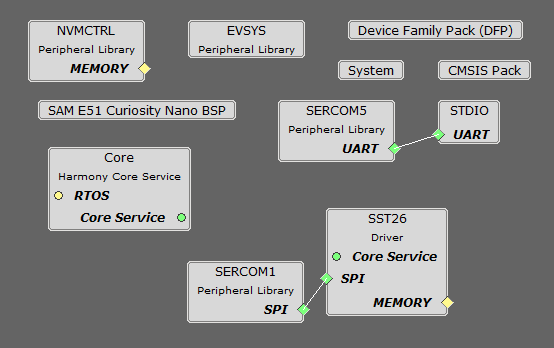 

## Hardware Used:

- [SAM E51 Curiosity Nano Evaluation Kit](https://www.microchip.com/en-us/development-tool/ev76s68a)
- [Mikroe Flash 2 Click](https://mikroe.com/flash-2-click)

## Software/Tools Used:
 This project has been verified to work with the following versions of software tools:  

Refer [Project Manifest](./firmware/src/config/sam_e51_cnano/harmony-manifest-success.yml) present in harmony-manifest-success.yml under the project folder *firmware/src/config/sam_e51_cnano*  
- Refer the [Release Notes](../../../../release_notes.md#microchip-mplab-harmony-3-release-notes) to know the **MPLAB X IDE** and **MCC** Plugin version. Alternatively, [Click Here](https://github.com/Microchip-MPLAB-Harmony/reference_apps/blob/master/release_notes.md#microchip-mplab-harmony-3-release-notes).

 Because Microchip regularly update tools, occasionally issue(s) could be discovered while using the newer versions of the tools. If the project doesn’t seem to work and version incompatibility is suspected, It is recommended to double-check and use the same versions that the project was tested with.  To download original version of MPLAB Harmony v3 packages, refer to document [How to Use the MPLAB Harmony v3 Project Manifest Feature](https://ww1.microchip.com/downloads/en/DeviceDoc/How-to-Use-the-MPLAB-Harmony-v3-Project-Manifest-Feature-DS90003305.pdf)

## Setup:
- Connect Mikroe Flash 2 Click and SAM E51 Curiosity Nano Evaluation Kit to the Curiosity Nano Base Board.
- Connect the SAM E51 Curiosity Nano Evaluation Kit to the Host PC as a USB Device through a Type-A male to micro-B USB cable connected to Micro-B USB (Debug USB) port.

  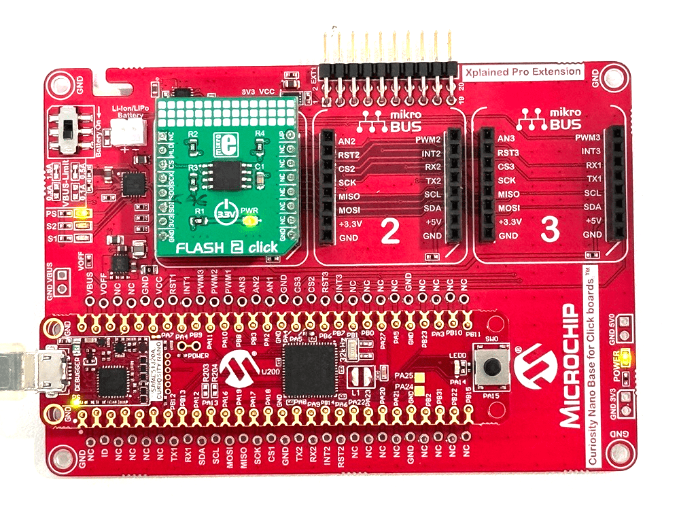

## Programming hex file:
The pre-built hex file can be programmed by following the below steps.  

### Steps to program the hex file
- Open MPLAB X IDE
- Close all existing projects in IDE, if any project is opened.
- Go to File -> Import -> Hex/ELF File
- In the "Import Image File" window, Step 1 - Create Prebuilt Project, Click the "Browse" button to select the prebuilt hex file.
- Select Device has "ATSAME51J20A"
- Ensure the proper tool is selected under "Hardware Tool"
- Click on Next button
- In the "Import Image File" window, Step 2 - Select Project Name and Folder, select appropriate project name and folder
- Click on Finish button
- In MPLAB X IDE, click on "Make and Program Device" Button. The device gets programmed in sometime
- Follow the steps in "Running the Demo" section below

## Programming/Debugging Application Project:
- Open the project (flash_2/firmware/sam_e51_cnano.X) in MPLAB X IDE
- Ensure "SAM E51 Curiosity Nano" is selected as hardware tool to program/debug the application
- Build the code and program the device by clicking on the "make and program" button in MPLAB X IDE tool bar
- Follow the steps in "Running the Demo" section below

## Running the Demo:
- Reset the device by power cycle
- LED0 is turned ON when the data read from SST26 flash matches with the data written using SAM E51 Curiosity Nano Evaluation Kit
  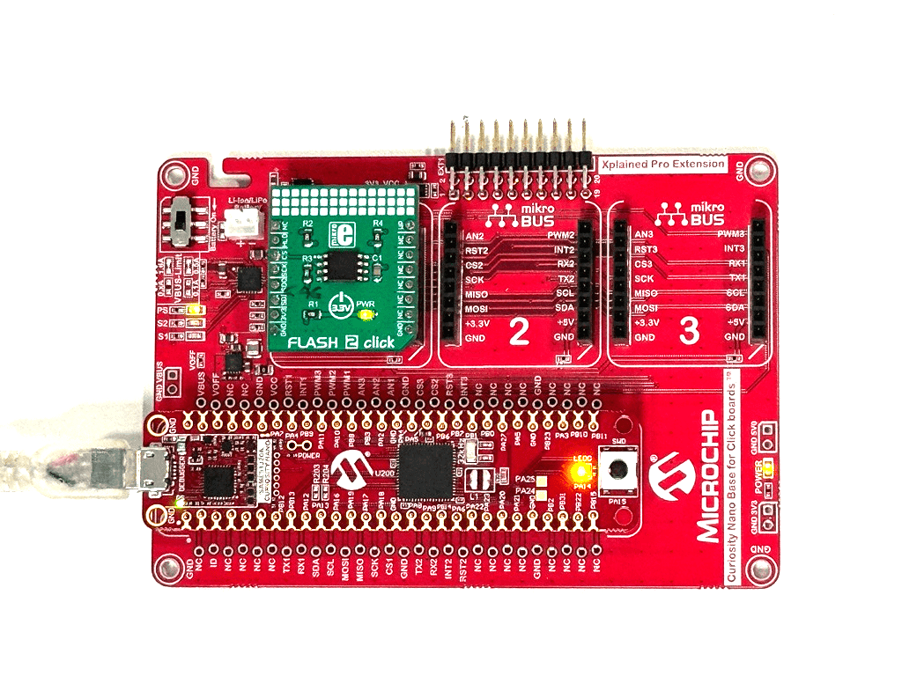

## Instructions to add Flash 2 Click functionality to your application:

You could use this demonstration as an example to add Flash 2 Click functionality to your MPLAB Harmony v3 based application. Follow the below steps.  
1. If you haven't downloaded the Flash 2 Click demo yet [Click Here](https://github.com/Microchip-MPLAB-Harmony/reference_apps/releases/latest/download/flash_2.zip) to download, otherwise go to next step
2. Unzip the downloaded .zip file  
3. From the unzipped folder flash_2/firmware/src, copy the folder **click_routines** to the folder firmware/src under your MPLAB Harmony v3 application project  
4. Open MPLAB X IDE  
5. Open your application project  
6. In the project explorer, Right click on folder **Header Files**  
   and add a sub folder **click_routines** by selecting "Add Existing Items from Folders..."  
	   

- Click on "Add Folder..." button  
	  

- Select the "click_routines" folder and select "Files of Types" as Header Files  
	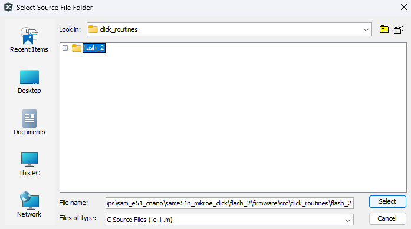

- Click on "Add" button to add the selected folder  
	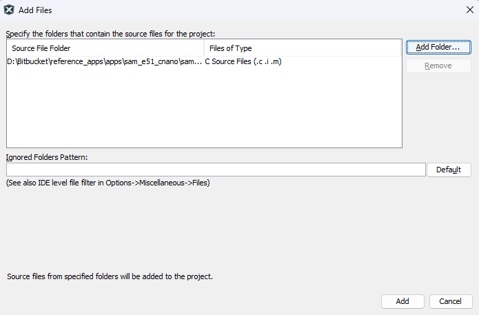

- The Flash 2 Click example header files gets added to your project  
	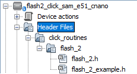

7. In the project explorer, Right click on folder **Source Files**  
   and add a sub folder **click_routines** by selecting "Add Existing Items from Folders..."   
	   

 - Click on "Add Folder..." button  
 	  

 - Select the "click_routines" folder and select "Files of Types" as Source Files  
 	

 - Click on "Add" button to add the selected folder  
 	

 - The Flash 2 Click example source files gets added to your project  
 	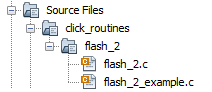

8. The Flash 2 Click example uses the **SPI**, **SST26 Driver**, **USART** peripherals and **PORT** pins . The configuration of these peripherals for your application depends on the 32-bit MCU and development board you are using.

	- **Configure SPI**:
 		- Add the SERCOM peripheral block to the MCC project graph  
		- Configure SPI Pins using MCC Pin configuration Window  
		The SPI configuration depends on
 			- 32-bit MCU
 			- 32-bit MCU development board
 			- The socket on which you have mounted the Flash 2 Click board  
 		*Example: The Flash 2 Click example on SAM E51 Curiosity Nano Evaluation Kit uses mikroBUS socket #1 on the Curiosity Nano Base for Click boards to mount the Flash 2 Click board. The SPI lines from MCU coming to this socket are from the SERCOM1 peripheral on the MCU.*  
		
		*MCC Project Graph - SPI configuration*  
		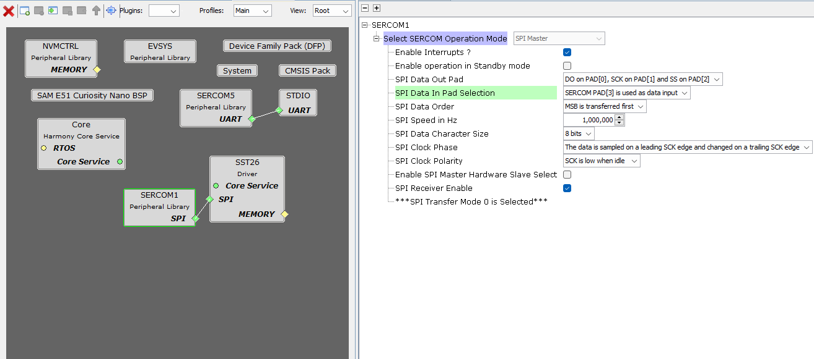  

		*MCC Pin Configurator - SPI pin configuration*  
		 

	- **Configure USART**:
 		- Add the SERCOM peripheral block to the MCC project graph  
		- Configure USART Pins using MCC Pin configuration Window  
		The USART configuration depends on
 			- 32-bit MCU
 			- 32-bit MCU development board
 			- The socket on which you have mounted the Flash 2 Click board  
 		*Example: The Flash 2 Click example on SAM E51 Curiosity Nano Evaluation Kit uses mikroBUS socket #1 on the Curiosity Nano Base for Click boards to mount the Flash 2 Click board. The USART lines from MCU coming to this socket are from the SERCOM1 peripheral on the MCU.*  
		
		*MCC Project Graph - USART configuration*  
		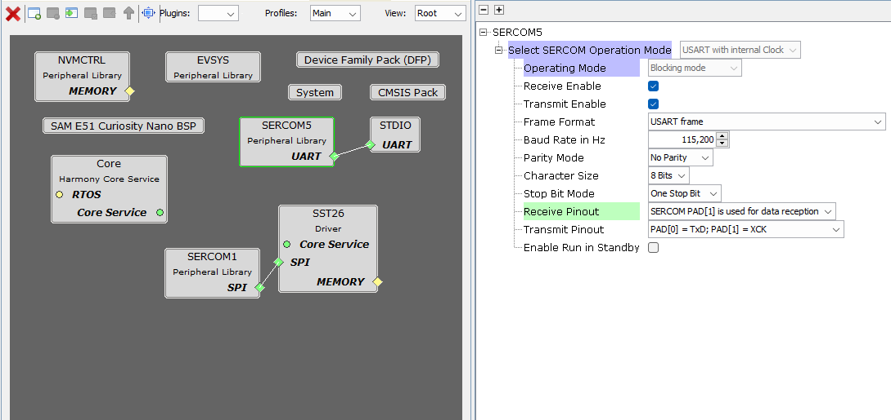  

		*MCC Pin Configurator - USART pin configuration*  
		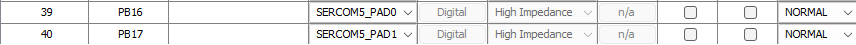 

    - **Configure SST26 Driver**:
 		- Add the SST26 Driver peripheral block to the MCC project graph  
		- Connect SERCOM 1 to SST26 Driver block
		  
		*MCC Project Graph - SST26 configuration*
		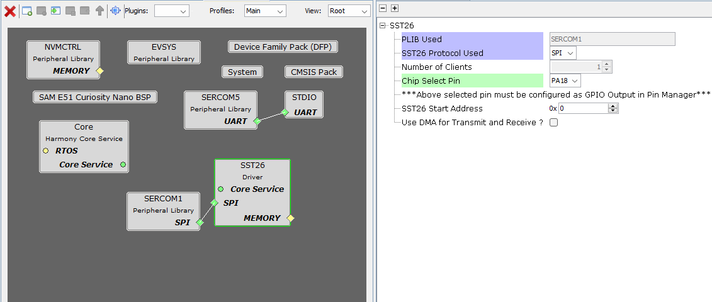
    - **Configure BSP**:
		- Add the SAM E51 Curiosity Nano BSP (Board Support packages)   
		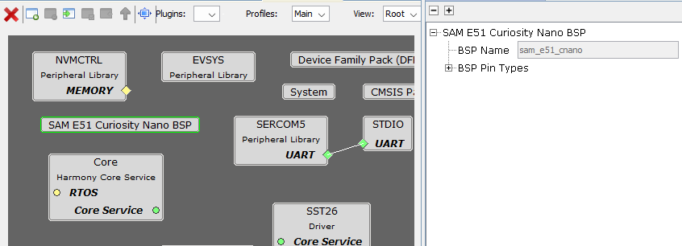   
        
    - **Configure Core**:
		- Add the Core block to the MCC project graph 
		*MCC Project Graph - Core configuration*  
		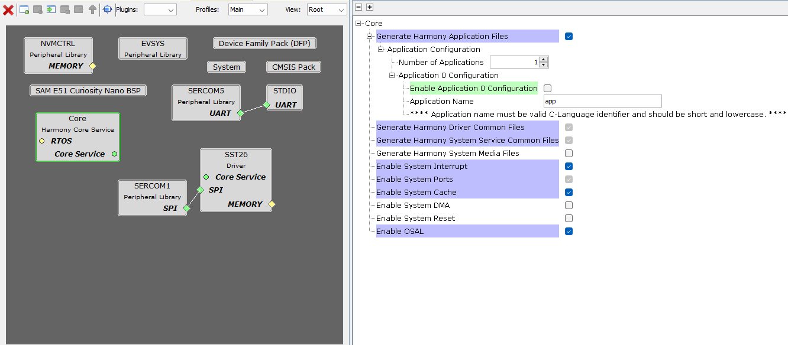
        
9. The **click_routines** folder contain an example C source file **flash_2_example.c**. You could use **flash_2_example.c** as a reference to add Flash 2 Click functionality to your application.

## Comments:
- Reference Training Module: [Getting Started Application on SAM E51 Curiosity Nano Evaluation Kit](https://microchip-mplab-harmony.github.io/reference_apps/apps/sam_e51_cnano/same51n_getting_started/readme.html)
- This application demo builds and works out of box by following the instructions above in "Running the Demo" section. If you need to enhance/customize this application demo, you need to use the MPLAB Harmony v3 Software framework. Refer links below to setup and build your applications using MPLAB Harmony.
	- [How to Setup MPLAB Harmony v3 Software Development Framework](https://ww1.microchip.com/downloads/en/DeviceDoc/How_to_Setup_MPLAB_%20Harmony_v3_Software_Development_Framework_DS90003232C.pdf)
	- [How to Build an Application by Adding a New PLIB, Driver, or Middleware to an Existing MPLAB Harmony v3 Project](https://www.microchip.com/content/dam/mchp/documents/MCU32/ProductDocuments/SupportingCollateral/How-to-Build-an-Application-by-Adding-a-New-PLIB-Driver-or-Middleware-to-an-Existing-MPLAB-Harmony-v3-Project-DS90003253.pdf)  
	-  **MPLAB Harmony v3 is also configurable through MPLAB Code Configurator (MCC). Refer to the below links for specific instructions to use MPLAB Harmony v3 with MCC.**
		- [Create a new MPLAB Harmony v3 project using MCC](https://microchipdeveloper.com/harmony3:getting-started-training-module-using-mcc)
		- [Update and Configure an Existing MHC-based MPLAB Harmony v3 Project to MCC-based Project](https://microchipdeveloper.com/harmony3:update-and-configure-existing-mhc-proj-to-mcc-proj)
		- [Getting Started with MPLAB Harmony v3 Using MPLAB Code Configurator](https://www.youtube.com/watch?v=KdhltTWaDp0)
		- [MPLAB Code Configurator Content Manager for MPLAB Harmony v3 Projects](https://www.youtube.com/watch?v=PRewTzrI3iE)	

## Revision:
- v1.7.0 - Released demo application
