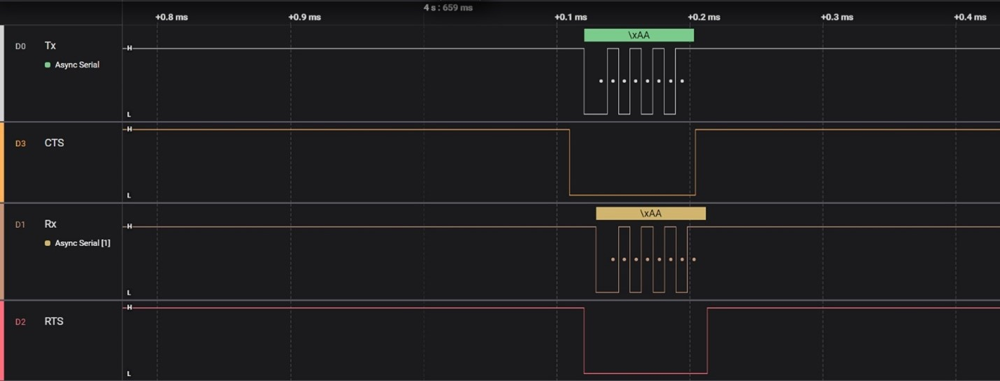

# USART hardware handshaking configuration in SAM E70 Xplained Ultra Evaluation Kit
<h2 align="center"> <a href="https://github.com/Microchip-MPLAB-Harmony/reference_apps/releases/latest/download/sam_e70_xult_usart_hardware_handshaking.zip" > Download </a> </h2>

-----
## Description

>  This application demonstrates the hardware handshaking functionality of USART communication between two SAM E70 Xplained Ultra Evaluation Kit. The host and client can send/receive data with the help of serial consoles.

## Modules/Technology Used:

- Peripheral Modules      
	- USART
	- EFC

## Hardware Used:

- [SAM E70 Xplained Ultra Evaluation Kit](https://www.microchip.com/en-us/development-tool/dm320113) 
- [Logic Analyzer](https://www.saleae.com/collections/logic-analyzers)  

## Software/Tools Used:

 This project has been verified to work with the following versions of software tools:  
- [MPLAB X IDE](https://www.microchip.com/en-us/tools-resources/develop/mplab-x-ide) v6.20
- [MPLAB Code Configurator Plugin](https://www.microchip.com/en-us/tools-resources/configure/mplab-code-configurator)  v5.5.1
- [MPLAB XC32](https://www.microchip.com/en-us/tools-resources/develop/mplab-xc-compilers) v4.45
- [csp](https://github.com/Microchip-MPLAB-Harmony/csp) v3.19.6
- SAME70_DFP v4.10.248
- [Logic 2 Software](https://www.saleae.com/pages/downloads?gad_source=1&gclid=CjwKCAjwxNW2BhAkEiwA24Cm9KGLD_xHCPJBRtSgUNVujkZRvFqLfVWTLGalrLMckyYz-9VuEeG6wxoCTWQQAvD_BwE) 

Refer [Project Manifest](./firmware/src/config/sam_e70_xult/harmony-manifest-success.yml) present in harmony-manifest-success.yml under the project folder *firmware/src/config/sam_e70_xult*  
- Refer the [Release Notes](../../../release_notes.md#microchip-mplab-harmony-3-release-notes) to know the **MPLAB X IDE** and **MCC** Plugin version. Alternatively, [Click Here](https://github.com/Microchip-MPLAB-Harmony/reference_apps/blob/master/release_notes.md#microchip-mplab-harmony-3-release-notes).  
- Any Serial Terminal application like Tera Term terminal application.

 Because Microchip regularly update tools, occasionally issue(s) could be discovered while using the newer versions of the tools. If the project doesn’t seem to work and version incompatibility is suspected, It is recommended to double-check and use the same versions that the project was tested with.  To download original version of MPLAB Harmony v3 packages, refer to document [How to Use the MPLAB Harmony v3 Project Manifest Feature](https://ww1.microchip.com/downloads/en/DeviceDoc/How-to-Use-the-MPLAB-Harmony-v3-Project-Manifest-Feature-DS90003305.pdf)

## Setup:
- Connect the Type-A male to Micro-B USB cable to Micro-B DEBUG USB port (J900) to program and debug the SAM E70 Xplained Ultra Evaluation Kit.
- Connect the pins according to the table given below

- |Host side|Client side|Logic Analyzer|
    |----------|----------|--------|
    |TX - PB01|RX - PB00|Channel 0|
    |RX - PB00|TX - PB01|Channel 1|
	|RTS - PB03|CTS - PB02|Channel 2|
	|CTS - PB02|RTS - PB03|Channel 3|
    |GND|GND|GND|
  
	**Note**: *A custom protoboard or breadboard is required, to connect the channels of the logic analyzer with the boards to probe the signals*

## Programming hex file:
The pre-built hex file can be programmed by following the below steps

### Steps to program the hex file
- Open MPLAB X IDE
- Close all existing projects in IDE, if any project is opened.
- Go to File -> Import -> Hex/ELF File
- In the "Import Image File" window, Step 1 - Create Prebuilt Project, click the "Browse" button to select the prebuilt hex file.
- Select Device has "ATSAME70Q21B"
- Ensure the proper tool is selected under "Hardware Tool"
- Click on "Next" button
- In the "Import Image File" window, Step 2 - Select Project Name and Folder, select appropriate project name and folder
- Click on "Finish" button
- In MPLAB X IDE, click on "Make and Program Device" Button. The device gets programmed in sometime.
- Follow the steps in "Running the Demo" section below

## Programming/Debugging Application Project:
- Open the project (sam_e70_xult_usart_hardware_handshaking\firmware\sam_e70_xult.X) in MPLAB X IDE
- Ensure "SAM E70 Xplained Ultra" is selected as hardware tool to program/debug the application
- Build the code and program both the devices by clicking on the "Make and Program Device" button in MPLAB X IDE tool bar
- Follow the steps in "Running the Demo" section below  

## Running the Demo:
- Open Logic 2 software (from the Windows® Start menu by pressing the Start button).
- Reset or power cycle both the devices.
- After programming the devices with the provided code, click the Run button to view the USART communication in the Logic 2 software.
- Below diagram shows the output displayed on salae Logic 2 software.
     

	**Note**: *Based on the reset release time, the width of the RTS and CTS line differs* 
	
## Comments:
- Reference Training Module:
	- [Getting Started with Harmony v3 Peripheral Libraries on SAM E70/S70/V70/V71 MCUs](https://microchipdeveloper.com/harmony3:same70-getting-started-training-module)
	- [Getting Started with MPLAB® Harmony v3 Drivers on SAM E70/S70/V70/V71 MCUs Using FreeRTOS](https://developerhelp.microchip.com/xwiki/bin/view/software-tools/harmony/same70-getting-started-tm-drivers-freertos/)
- This application demo builds and works out of box by following the instructions above in "Running the Demo" section. If you need to enhance/customize this application demo, you need to use the MPLAB Harmony v3 Software framework. Refer links below to setup and build your applications using MPLAB Harmony.
	- [How to Setup MPLAB Harmony v3 Software Development Framework](https://ww1.microchip.com/downloads/aemDocuments/documents/MCU32/ProductDocuments/SupportingCollateral/How-to-Setup-MPLAB-Harmony-v3-Software-Development-Framework-DS90003232.pdf)
	- [Video - How to Set up the Tools Required to Get Started with MPLAB® Harmony v3 and MCC](https://www.youtube.com/watch?v=0rNFSlsVwVw)
	- [Create a new MPLAB Harmony v3 project using MCC](https://developerhelp.microchip.com/xwiki/bin/view/software-tools/harmony/getting-started-training-module-using-mcc/)
	- [Update and Configure an Existing MHC-based MPLAB Harmony v3 Project to MCC-based Project](https://developerhelp.microchip.com/xwiki/bin/view/software-tools/harmony/update-and-configure-existing-mhc-proj-to-mcc-proj/)
	- [How to Build an Application by Adding a New PLIB, Driver, or Middleware to an Existing MPLAB Harmony v3 Project](https://ww1.microchip.com/downloads/aemDocuments/documents/MCU32/ProductDocuments/SupportingCollateral/How-to-Build-an-Application-by-Adding-a-New-PLIB-Driver-or-Middleware-to-an-Existing-MPLAB-Harmony-v3-Project-DS90003253.pdf)

## Revision:
- v1.7.0 - Released demo application
